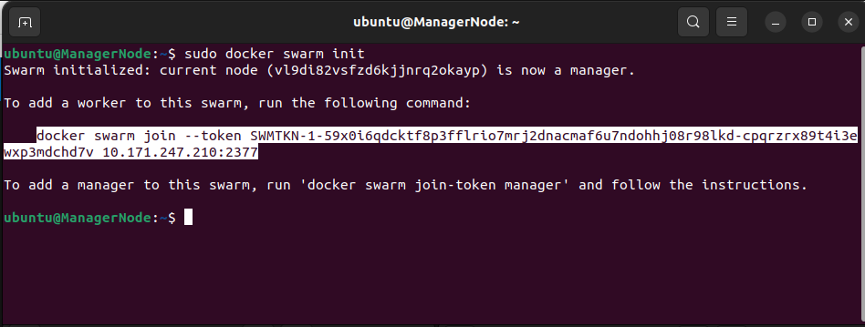
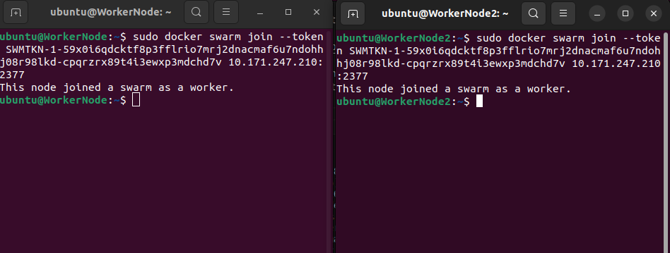

# Objective: Set Up a Docker Swarm Cluster

**Tasks**:
    1. Initialize a cluster of Docker Engines in swarm
    2. Add nodes to the Swarm
    3. Deploy application services to the Swarm
    4. Manage the Swarm once you have everything running

1. ## Initialize a cluster of Docker Engines in swarm

    To demostrate I'll need 3 Linux Hosts each having Docker installed and will communicate over a network. For this task, I'll be using Canonical's Multipass to create Ubuntu VMs (Virtual Machines).

    Using **Multipass**, I have created 3 VMs as shown below:

    

2. ## Add nodes (VMs) to the Swarm

    In the **ManagerNode** I typed the following to initialize the Swarm:

        $ docker swarm init

    This was the result:

    

    I used the highlighted command to join **WorkerNode** and **WorkerNode2** into the swarm;

    **NOTE**: If the highlighted command above is not available, the type the following:

        $ docker swarm join-token worker

    

    We now have a 3-Node Swarm.

3. ## Deploy application services to the Swarm

    [Commands and Visual Aid]

4. ## Manage the Swarm once you have everything running

    [Commands and visual aid]