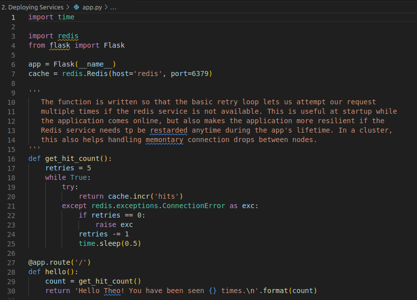
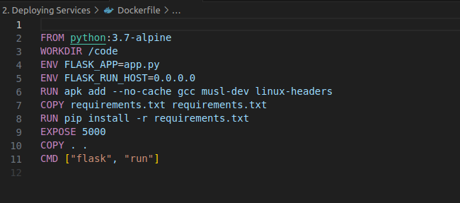
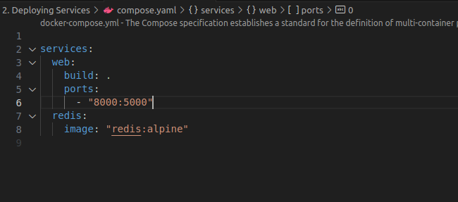
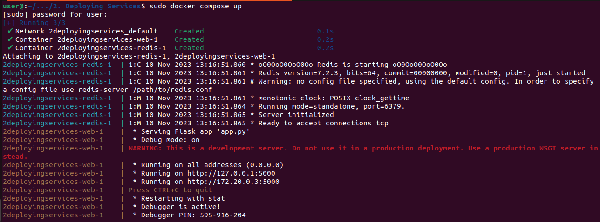
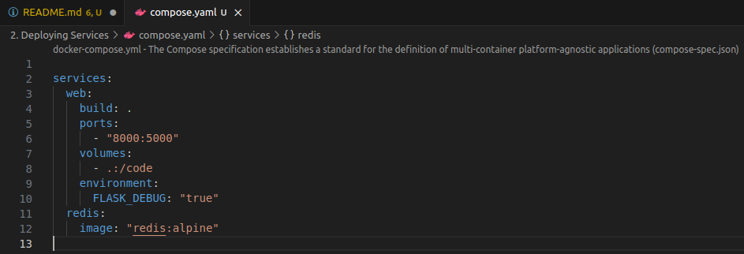
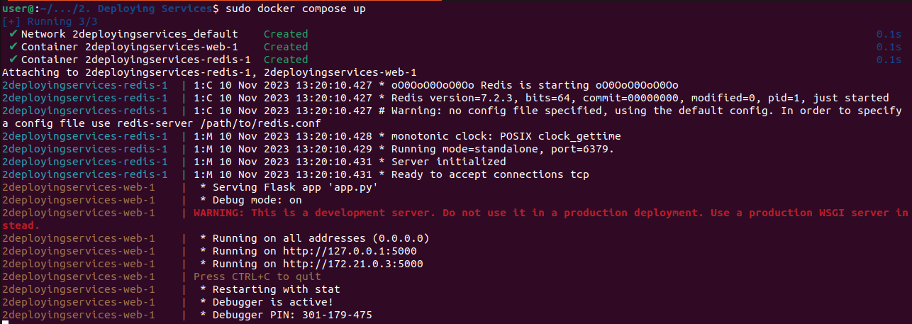
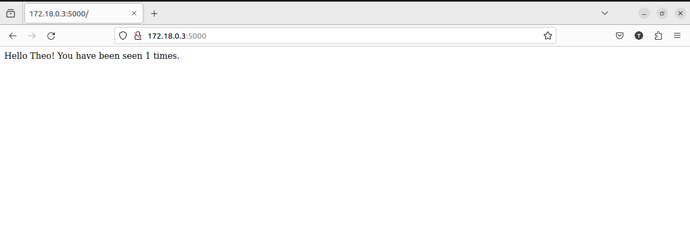

# Deploying Services

In this project I will be deploying a service using **Docker Compose V3**.
Docker Compose is a tool used for defining and running multi-container Docker applications. 
It uses a YAML file to help us configure our application's services. 
After you've typed in your configurations, with a single command, you create and start all 
the services from your configuration.

To demostrate how it works, will be building a simple Python Wed application which uses the 
Flask framework and maintains a hit counter in Redis.

1. ## Add application and it's dependencies 

    

2. ## Create a Dockerfile

    

3. ## Create a Compose file and define your services

    

4. ## Build and run your app with Compose

    

5. ## Edit the Compose file to add a bind mount

    

6. ## Re-build and run the app with Compose

    

7. ## Application running

    